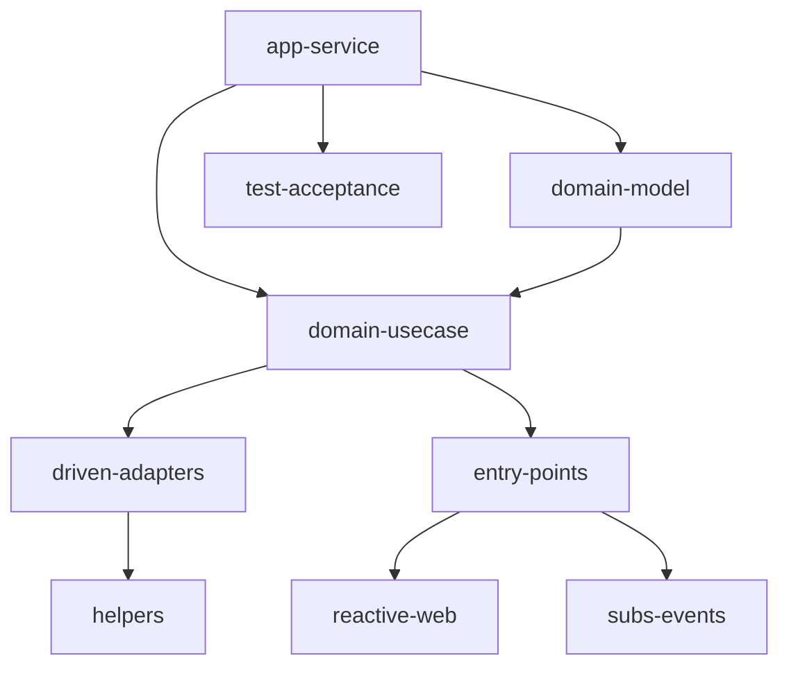

# Arquitectura del Sistema: pruebalegoback

## Overview

El sistema `pruebalegoback` es una aplicación backend modular basada en Java y Gradle, estructurada bajo principios de Clean Architecture. Su objetivo es ofrecer una base robusta, escalable y mantenible para el desarrollo de servicios y microservicios, facilitando la separación de responsabilidades y la trazabilidad de los cambios.

## Arquitectura Interna

El sistema se organiza en los siguientes módulos principales:

- **applications/app-service**: Punto de entrada de la aplicación, expone servicios y configura el arranque.
- **domain/model**: Contiene los modelos de dominio y entidades centrales del negocio.
- **domain/usecase**: Implementa los casos de uso y lógica de negocio.
- **infraestructure/driven-adapters**: Adaptadores para integración con sistemas externos (bases de datos, colas, etc.).
- **infraestructure/entry-points**: Puntos de entrada como APIs web reactivas y suscripciones a eventos.
- **infraestructure/helpers**: Utilidades y módulos de soporte, como seguridad.
- **test/acceptance**: Pruebas de aceptación y validación end-to-end.

### Diagrama de Componentes (Mermaid)

## APIs y Exposición

- **Reactive Web**: Expone APIs REST reactivas (posiblemente usando Spring WebFlux) para interacción con clientes.
- **Subs Events**: Maneja eventos y suscripciones para integración asíncrona.

## Dependencias

- Java 17+
- Gradle 8+
- Lombok
- Herramientas de CI/CD (Azure Pipelines)
- SonarQube para análisis de calidad

## Despliegue

- Contenedores Docker (Dockerfile en app-service)
- Integración con pipelines de Azure para despliegue automatizado

## Consideraciones de Seguridad

- Módulo `security-app` para gestión de autenticación y autorización.
- Configuración de seguridad centralizada en infraestructure/helpers/security-app.

## Observaciones

- La arquitectura permite escalar agregando nuevos entry-points o driven-adapters sin afectar el dominio.
- La documentación y los estándares se generan y mantienen en la carpeta `docs/architecture` siguiendo el Método Ceiba.

---

> Última actualización: 29/09/2025
