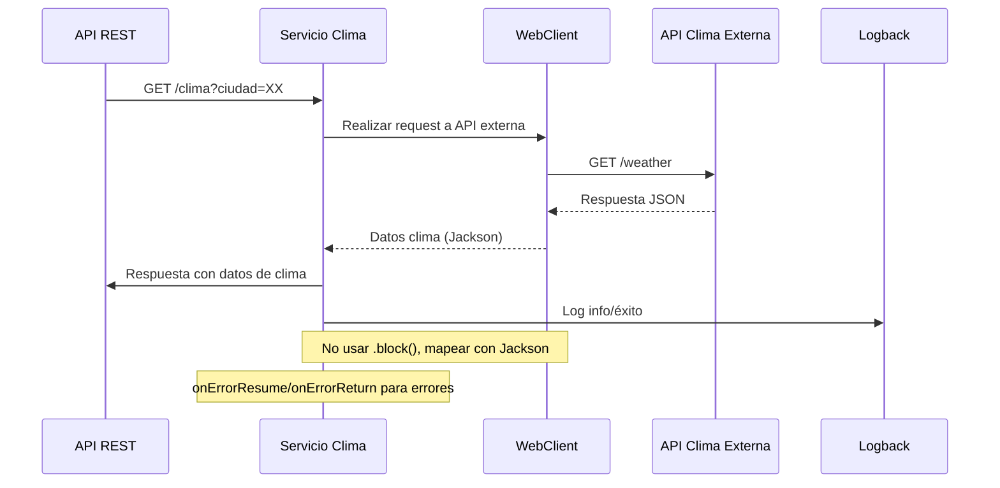

# Flujo de Negocio: Consulta de Clima Externo

## Descripción
Este flujo describe cómo el sistema consume una API externa para obtener el estado del clima en Estados Unidos, mapeando la respuesta con Jackson y retornando el resultado vía API.

## Diagrama de Secuencia

## Manejo de Errores
- onErrorResume para errores técnicos (timeout, red, parsing)
- onErrorReturn para errores de negocio (ciudad no encontrada)
- Logging de errores y eventos relevantes

## Casos de Prueba
- Consulta exitosa
- Error de red/API externa
- Error de mapeo Jackson
- Ciudad no encontrada

## Métricas
- Tiempo de respuesta
- Tasa de éxito/fallo
