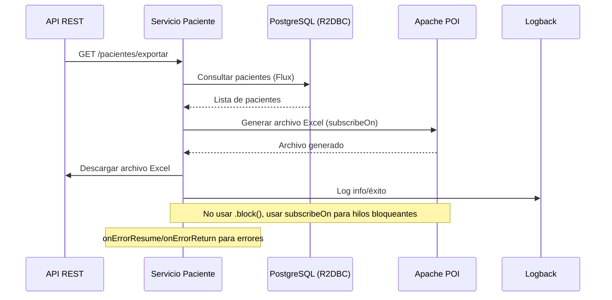

# Flujo de Negocio: Exportación de Pacientes a Excel

## Descripción
Este flujo describe cómo se exportan los pacientes a un archivo Excel usando Apache POI, gestionando hilos bloqueantes de forma reactiva.

## Diagrama de Secuencia

## Manejo de Errores
- onErrorResume para errores técnicos (DB, POI)
- onErrorReturn para errores de negocio
- Logging de errores y eventos relevantes

## Casos de Prueba
- Exportación exitosa
- Error al consultar pacientes
- Error al generar archivo Excel

## Métricas
- Tiempo de generación
- Tamaño del archivo
- Tasa de éxito/fallo
