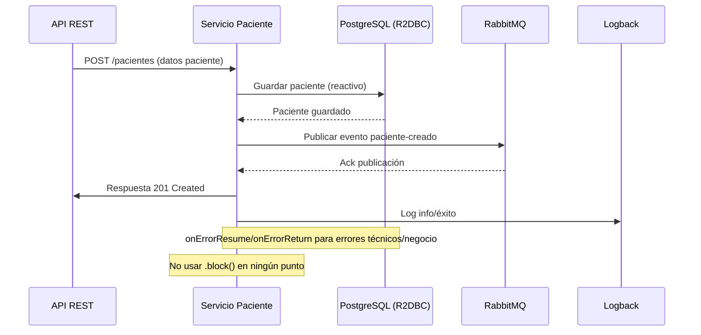

# Flujo de Negocio: Registro de Paciente

## Descripción
Este flujo describe el proceso completo para registrar un paciente en la clínica, incluyendo persistencia, publicación en RabbitMQ y manejo de errores.

## Diagrama de Secuencia

## Manejo de Errores
- onErrorResume para errores técnicos (DB, MQ)
- onErrorReturn para errores de negocio (validaciones)
- ControllerAdvice para respuestas HTTP adecuadas
- Logging de errores y eventos relevantes

## Casos de Prueba
- Registro exitoso
- Error de validación (negocio)
- Error de persistencia (técnico)
- Error al publicar en RabbitMQ

## Métricas
- Tiempo de respuesta
- Tasa de éxito/fallo
- Mensajes publicados en MQ
